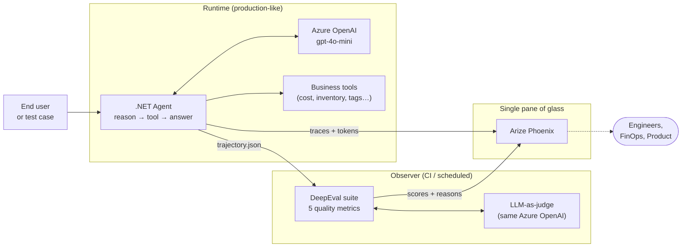
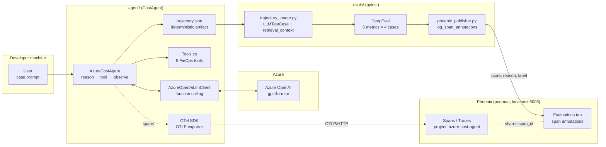
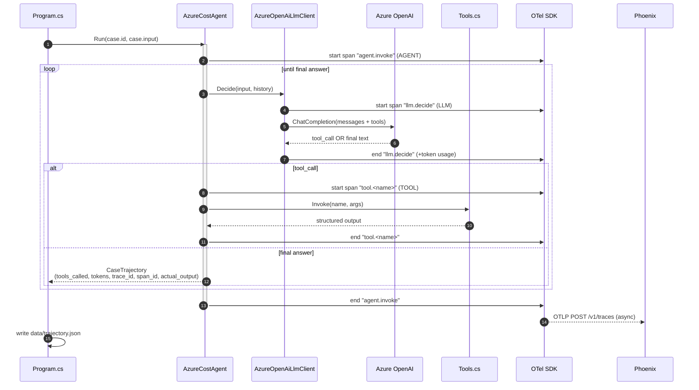
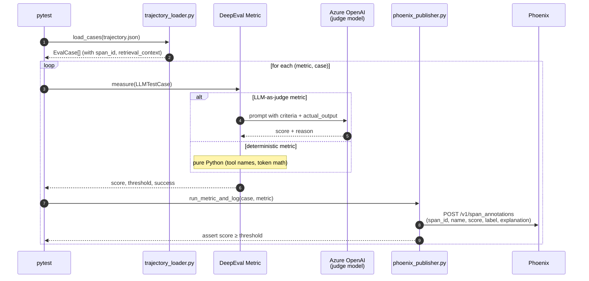

# Scenario 1 — .NET agent + OpenTelemetry + DeepEval + Arize Phoenix

> Part of the [agent-eval-poc](../README.md) repo. See also
> [scenario-2](../scenario-2/README.md) (Microsoft-native: Azure AI
> Foundry), [scenario-3](../scenario-3/README.md) (full governance
> gateway with APIM AI Gateway, GitHub audit-log puller and Copilot
> programmatic extension), and [scenario-4](../scenario-4/README.md)
> (source-control attribution: agent vs. human in PRs).
> The .NET agent under [../agent/](../agent/) is **shared** between
> scenarios 1–3; only the evaluation harness and the trace sink
> differ. Scenario 4 operates at the source-control layer and is
> agent-vendor-neutral.

**TL;DR.** This scenario shows that a non-Microsoft agent (built on any
cloud, any model) can be put under a **production-grade evaluation
pipeline** using only open-source components: OpenTelemetry, Arize
Phoenix, and DeepEval. Pytest fails the build on regressions; Phoenix
stores the trace and the evaluator scores side by side. No managed
services, no vendor lock-in.

## How this scenario differs from the other three

| Capability | **Scenario 1 (this one)** | Scenario 2 | Scenario 3 | Scenario 4 |
| --- | --- | --- | --- | --- |
| Layer governed | Runtime eval | Runtime eval + safety | Runtime gateway | **Source control** |
| Trace backend | Arize Phoenix (self-hosted) | Azure Application Insights | Azure Application Insights + APIM AI Gateway metrics | Git history (no trace backend) |
| Evaluators | DeepEval (pytest, LLM-as-judge + deterministic) | Foundry Quality + Risk & Safety (preview) | Both — plus a custom governance judge run from the IDE | None — PR comment is descriptive, not a verdict |
| CI gate | ✅ Pytest exits non-zero on regressions | ✅ KQL/Foundry continuous eval | ✅ Same, plus pre-call policy in APIM | ✅ `pre-push` runs tests locally + sticky PR comment |
| Pre-call policy (jailbreak shield, token quota) | ❌ | ❌ | ✅ APIM AI Gateway | ❌ (out of scope) |
| Per-team / per-agent cost attribution | ❌ | ⚠️ tag-based | ✅ priced YAML + APIM dims | ❌ (out of scope) |
| Governed Copilot Chat in the IDE | ❌ | ❌ | ✅ VS Code extension (Layer 4) | ❌ |
| Per-PR % of lines by agent vs. human | ❌ | ❌ | ❌ | ✅ sticky PR comment |
| Deployment footprint | 1 Azure OpenAI account + 1 Docker container | Foundry + App Insights + Log Analytics | All of scenario 2 + APIM + (optional) GitHub workflow | None — git + GitHub Actions |
| Time to deploy | ~5 min | ~10 min | ~30 min | <5 min |

## How this scenario maps to commercial / OSS observability vendors

| Capability | Datadog LLM Obs | LangSmith | Helicone | Phoenix (OSS) | **This scenario** |
| --- | --- | --- | --- | --- | --- |
| OpenTelemetry-native trace ingestion | ✅ | ⚠️ partial | ⚠️ proxy only | ✅ | ✅ (uses Phoenix directly) |
| Self-hostable | ❌ SaaS | ⚠️ self-host beta | ✅ | ✅ | ✅ (Phoenix in Docker) |
| LLM-as-judge metrics tied to traces | ⚠️ | ✅ | ❌ | ⚠️ via custom code | ✅ DeepEval `GEval` |
| Deterministic metrics (tool order, token budget) | ❌ | ⚠️ | ❌ | ❌ | ✅ DeepEval custom metrics |
| Pytest exit code drives CI | ⚠️ via API | ✅ | ❌ | ❌ | ✅ native |
| Versioned dataset + experiment replay | ❌ | ✅ | ❌ | ✅ Experiments | ✅ Phoenix Experiments |
| Per-PR HTML report | ❌ | ⚠️ | ❌ | ❌ | ⚠️ pytest console + Phoenix UI |

> The gap this scenario closes vs. Phoenix-only: a **pytest-driven CI
> gate** with deterministic + LLM-as-judge metrics that publishes scores
> back to the same Phoenix project as span annotations, so the
> dashboard shows reasoning + grade in one place.

## Executive summary (for any audience)

LLM-powered agents are non-deterministic: the same question can produce a
different answer, a different chain of tool calls, and a different cost on
every run. Shipping that to production without **continuous evaluation** is
the equivalent of releasing software with no tests and no monitoring.

This repository is a **minimum-viable blueprint** that shows, end to end,
how to put an LLM agent under measurable, automated quality control:

- **Agent** — a small .NET 9 "Azure FinOps assistant" answers questions
  about a synthetic Azure subscription (cost, inventory, tags, savings).
- **Observability** — every reasoning step, tool call and token count is
  emitted as an **OpenTelemetry** span and streamed to **Arize Phoenix**
  (a free, self-hosted UI for LLM traces).
- **Quality gate** — a **DeepEval** + **pytest** suite scores each answer
  on five criteria and **fails the build** if any score regresses.
- **Closed loop** — those scores are published back into Phoenix as span
  annotations, so a single dashboard shows the agent's behaviour **and**
  its quality grade, with `trace_id` / `span_id` linking both sides.

What a CxO / architect / engineer can take away from this repo:

| Audience | What this demo proves |
|---|---|
| **CxO / Product** | Agent quality, cost, and behaviour can be measured continuously, not just "vibes-checked" |
| **Architect** | A clean separation between the runtime (agent) and the observer (evaluator), bridged by a single artifact (`trajectory.json`) and standard OTel spans |
| **Engineer** | Concrete code for Azure OpenAI function calling, OpenInference span conventions, DeepEval custom metrics, and the Phoenix v17 annotation API |
| **FinOps / SecOps** | Token usage and tool selection are first-class signals — you can alert on cost drift the same way you alert on latency |

### Executive diagram



One sentence: **the agent runs, Phoenix records what happened, DeepEval
grades it, and Phoenix shows the grade next to the trace — automatically.**

---

## Repository at a glance

The agent is a small Azure FinOps assistant written in **.NET 9** that
answers cost / inventory / tag questions about a synthetic Azure subscription
by calling tools through **OpenAI function calling** against
**Azure OpenAI (`gpt-4o-mini`)**.

Every run produces two artifacts in parallel:

1. **OpenTelemetry spans** pushed to **Arize Phoenix** (live UI, traces &
   evaluations tab).
2. A deterministic **`trajectory.json`** artifact consumed by a **DeepEval**
   pytest suite that publishes the resulting scores back to Phoenix as span
   annotations.

The result is a single dashboard where you can see the agent's reasoning tree
**and** the evaluator scores side by side, while `pytest` exits non-zero on
regressions so the same suite works as a CI gate.

---

## What's in the box

| Layer | Tech | Path |
|---|---|---|
| Agent (reason → tool → observe loop) | .NET 9, `Azure.AI.OpenAI` 2.1, OpenTelemetry 1.10, OpenInference span conventions | [../agent/](../agent/) |
| Tools (5 FinOps tools + JSON schemas) | Static C# data | [../agent/Agent/Tools.cs](../agent/Agent/Tools.cs) |
| LLM client (function calling, USD answers) | Azure OpenAI ChatClient | [../agent/Agent/AzureOpenAiLlmClient.cs](../agent/Agent/AzureOpenAiLlmClient.cs) |
| Trajectory contract | `cases[]` with `input`, `actual_output`, `tools_called`, `tokens`, `trace_id`, `span_id` | [../agent/Agent/Trajectory.cs](../agent/Agent/Trajectory.cs) |
| Evaluator suite (5 metrics × 4 cases) | DeepEval 4.x, pytest | [evals/test_agent_trajectory.py](evals/test_agent_trajectory.py) |
| Phoenix bridge (publishes scores per span) | `phoenix.client.Client.spans.add_span_annotation` | [evals/phoenix_publisher.py](evals/phoenix_publisher.py) |
| Phoenix experiment (versioned dataset + deterministic replay) | `phoenix.client.Client.datasets` + `experiments.run_experiment` | [evals/phoenix_experiment.py](evals/phoenix_experiment.py) |
| Infra (Azure OpenAI + `gpt-4o-mini`) | Bicep | [infra/main.bicep](infra/main.bicep) |
| Trace backend | Arize Phoenix v17 in podman | n/a |

### What is DeepEval and what does it do here?

[DeepEval](https://github.com/confident-ai/deepeval) is an open-source
Python library that lets you write **unit tests for LLM output** the same
way `pytest` lets you write unit tests for code. It provides:

- **Deterministic metrics** (e.g. did the agent call the expected tool?
  did it exceed a token budget?) — pure Python, no LLM call, no cost.
- **LLM-as-judge metrics** (`GEval`) — you describe the criterion in plain
  English ("the answer must directly address the question") and DeepEval
  asks a judge model to score it from 0 to 1 with a reason.
- A single `assert score >= threshold` pattern so the suite plugs into any
  CI without extra tooling.

This repo uses **the same Azure OpenAI deployment** as the agent's judge,
so there is only one set of credentials to manage.

### Evaluators in this repo

| Metric | Type | What it checks | Why it matters |
|---|---|---|---|
| `ToolCorrectness` | Deterministic | The agent called every expected tool | Catches regressions where the model skips a step |
| `TokenBudget` | Deterministic | Total tokens ≤ a per-case cap | FinOps guard against silent cost drift |
| `TaskCompletion` (`GEval`) | LLM-as-judge | The answer actually solves the user's request | Detects "sounds right but isn't" answers |
| `Groundedness` (custom `GEval`) | LLM-as-judge | Every `$`, `%`, and resource name in the answer appears in a tool output | Detects hallucinated numbers |
| `AnswerRelevancy` | LLM-as-judge | The answer directly addresses the question | Detects evasive or off-topic answers |

### Tools the agent can call

The agent does **not** talk to a real Azure subscription. The five tools in
[../agent/Agent/Tools.cs](../agent/Agent/Tools.cs) return canned data so the
demo is fully reproducible and free to run.

| Tool | Input | Output | Used for |
|---|---|---|---|
| `list_resources` | none | array of `{id, type, sku, region}` | Inventory questions, always called first |
| `get_unit_price` | `resource_id` | `{hourly_usd, monthly_usd}` | Per-resource cost lookup |
| `estimate_monthly_cost` | `resource_ids[]` | `{total_usd, breakdown}` | Subscription-wide cost roll-up |
| `get_resource_tags` | `resource_id` | `{tags: {key: value}}` | Tag / governance queries |
| `get_savings_recommendations` | none | array of `{resource_id, action, savings_usd}` | FinOps optimization questions |

The system prompt forces the agent to call these tools in the right order
(see [`AzureOpenAiLlmClient.cs`](../agent/Agent/AzureOpenAiLlmClient.cs)) so
the deterministic evaluators have something stable to assert against.

---

## How the demo works

### High-level flow



### Per-case sequence (one of four cases)



### Evaluation phase (after `dotnet run` finishes)



The bridge between the two halves is the **`span_id`** that .NET captures from
the `agent.invoke` span and writes into `trajectory.json`. The Python suite
then attaches each evaluator score to that exact span in Phoenix.

---

## Quick start

### 1. Prerequisites

| Requirement | Tested version |
|---|---|
| .NET SDK | 9 (10 preview also works) |
| Python | 3.13 |
| podman (or docker) | 5.x rootless |
| Azure CLI | logged into a subscription with Azure OpenAI access |
| OS | Windows / PowerShell (commands below) |

### 2. Deploy Azure OpenAI

```powershell
# Creates RG, Azure OpenAI account (kind=OpenAI, NOT Foundry — API-key friendly)
# and a gpt-4o-mini deployment. Writes credentials to .env (gitignored).
./infra/deploy.ps1
```

### 3. Start Phoenix in podman

```powershell
podman run -d --name phoenix `
  -p 127.0.0.1:6006:6006 -p 127.0.0.1:4317:4317 `
  docker.io/arizephoenix/phoenix:latest
```
Open <http://127.0.0.1:6006>.

### 4. Install Python deps

```powershell
python -m venv .venv
.\.venv\Scripts\python.exe -m pip install -r evals/requirements.txt
```

### 5. Build .NET

```powershell
dotnet build ../agent -c Release
```

### 6. Run the agent (real LLM) and the eval suite

```powershell
$env:USE_REAL_LLM='YES'
dotnet run --project ../agent -c Release --no-build -- data/trajectory.json
.\.venv\Scripts\python.exe -m pytest evals -v
```

Then open Phoenix → project `azure-cost-agent` → click any trace.
You'll see the full reasoning tree (`agent.invoke` → `llm.decide` →
`tool.*`) and each evaluator score attached as a span annotation.

> Tip: omit `USE_REAL_LLM=YES` to run with the deterministic mock LLM (no
> API calls — useful for unit testing the harness itself).

### 7. (Optional) Interactive mode — chat with the agent live

Instead of the four canned cases, you can drive the agent yourself. Each
prompt you type creates a brand-new trace in Phoenix and appends a new
case to a separate trajectory file:

```powershell
$env:USE_REAL_LLM='YES'
dotnet run --project ../agent -c Release --no-build -- data/live.json --interactive
```

```
you> Which is the most expensive resource?
agent> The most expensive resource is vm-prod-01 at $312.00/month.
       (tools=4 tokens=2511 6420 ms  trace=ab12…)

you> exit
```

While you chat, refresh Phoenix — each turn shows up as a new trace under
the same `azure-cost-agent` project. You can then run the evaluator on
the live file just like with the fixture:

```powershell
$env:TRAJECTORY_PATH = 'data/live.json'
.\.venv\Scripts\python.exe -m pytest evals -v
```

---

## Two Phoenix workflows (annotations vs experiments)

Phoenix supports **two complementary evaluation patterns**, and this repo
exercises both so you can see when to use each:

| | Span annotations (default) | Datasets + Experiments |
|---|---|---|
| Where it lives in the UI | Each trace → **Evaluations** panel | `/datasets` and `/experiments` (left nav) |
| Input source | Real production traffic (any prompt, incl. `--interactive`) | A **versioned dataset** of canonical examples |
| Best for | Continuous monitoring of live traffic | A/B comparing prompts, models, temperatures over time |
| How we publish | `evals/phoenix_publisher.py` (per `pytest` run) | `evals/phoenix_experiment.py` (one-shot, deterministic) |
| Cost per run | One judge call per LLM-as-judge metric | Currently zero — only the two deterministic evaluators replay against the stored answer |

Run the Experiment view once after generating a trajectory:

```powershell
.\.venv\Scripts\python.exe evals/phoenix_experiment.py
```

```
[experiment] dataset created: id=… examples=4
Experiment completed: 4 task runs, 2 evaluator runs, 8 evaluations
[experiment] OK -> http://localhost:6006/datasets/…/compare?experimentId=…
```

Open the URL it prints. You will see a side-by-side table of the 4 cases
with `tool_correctness` and `token_budget` scores, ready to be compared
against future experiment runs (e.g. after changing the system prompt or
the model).

> Why is the task a "replay" instead of re-running the agent?
> Because the agent already produced the answer and we want the Experiment
> to be deterministic and free. If you want Phoenix to **re-execute the
> agent** per example, swap `replay_task` for a function that calls your
> .NET binary or an HTTP endpoint hosting the agent.

---

## Repository layout

```
.
├── data/
│   ├── trajectory.json           # produced by .NET (4 fixture cases), consumed by pytest
│   └── live.json                 # appended by --interactive mode (one case per prompt)
├── ../agent/                    # the shared agent (root of the repo)
│   ├── Program.cs                # OTel wiring, .env loading, fixture vs --interactive mode
│   ├── Agent/
│   │   ├── AzureCostAgent.cs     # reason → tool → observe loop
│   │   ├── AzureOpenAiLlmClient.cs  # real LLM (Azure OpenAI + function calling)
│   │   ├── ILlmClient.cs         # interface + deterministic mock
│   │   ├── Tools.cs              # 5 FinOps tools + JSON schemas
│   │   └── Trajectory.cs         # JSON contract .NET ↔ Python
│   └── Telemetry/AgentTelemetry.cs  # OpenInference span helpers
├── evals/                        # the evaluation suite
│   ├── test_agent_trajectory.py  # 5 metrics × 4 cases (pytest)
│   ├── trajectory_loader.py      # JSON → DeepEval LLMTestCase
│   ├── phoenix_publisher.py      # publishes scores to Phoenix spans
│   ├── phoenix_experiment.py     # publishes a Dataset + Experiment for the Phoenix Experiments UI
│   ├── conftest.py               # loads .env, sys.path
│   └── requirements.txt
├── infra/
│   ├── main.bicep                # Azure OpenAI + gpt-4o-mini
│   └── deploy.ps1                # provisions and writes .env
└── README.md
```

---

## Configuration (`.env`) — step by step

If you ran `./infra/deploy.ps1`, the `.env` file is already created and
gitignored. If you are wiring this against an existing Azure OpenAI account
instead, **copy [`../.env.scenario-1.example`](../.env.scenario-1.example)
to `.env` at the repo root and fill in your values**. The full block is
reproduced and explained below.

> **Before committing anything.** The `.env` file is in `.gitignore`. Only
> [`../.env.scenario-1.example`](../.env.scenario-1.example) (placeholders,
> no real keys) is tracked. If you ever stage a real key by accident,
> rotate it before pushing:
>
> ```powershell
> az cognitiveservices account keys regenerate `
>     --name <your-aoai-account> --resource-group <rg> --key-name Key1
> ```

```dotenv
# ---------------------------------------------------------------------------
# REQUIRED — tells the agent to talk to a real LLM instead of the local mock.
# Leave this unset (or =NO) to run a deterministic mock for harness testing.
# ---------------------------------------------------------------------------
USE_REAL_LLM=YES

# ---------------------------------------------------------------------------
# REQUIRED — tells DeepEval to use the SAME Azure OpenAI account as the judge
# model for the LLM-as-judge metrics (TaskCompletion, Groundedness, etc).
# If you set this to NO, DeepEval will look for OPENAI_API_KEY instead.
# ---------------------------------------------------------------------------
USE_AZURE_OPENAI=YES

# ---------------------------------------------------------------------------
# REQUIRED — your Azure OpenAI resource endpoint. Copy it verbatim from the
# Azure Portal: Azure OpenAI → your resource → "Keys and Endpoint".
# Must end with a trailing slash.
# Example shown below uses a fake account name; replace with your own.
# ---------------------------------------------------------------------------
AZURE_OPENAI_ENDPOINT=https://my-openai-account.openai.azure.com/

# ---------------------------------------------------------------------------
# REQUIRED — the API key for that endpoint (KEY 1 or KEY 2 in the portal).
# Treat this like a password. Never commit it. Rotate periodically.
# ---------------------------------------------------------------------------
AZURE_OPENAI_API_KEY=00000000000000000000000000000000

# ---------------------------------------------------------------------------
# REQUIRED — the *deployment name* you gave the model when you created the
# deployment in Azure OpenAI Studio. NOT the model family name.
# Example: you deployed gpt-4o-mini and called the deployment "gpt-4o-mini".
# ---------------------------------------------------------------------------
AZURE_DEPLOYMENT_NAME=gpt-4o-mini

# ---------------------------------------------------------------------------
# REQUIRED for DeepEval — the underlying model family and version. DeepEval
# uses these to negotiate the correct token encoding and pricing tables.
# Get the version string from Azure OpenAI Studio → Deployments → your row.
# ---------------------------------------------------------------------------
AZURE_MODEL_NAME=gpt-4o-mini
AZURE_MODEL_VERSION=2024-07-18

# ---------------------------------------------------------------------------
# REQUIRED — the REST API version both the agent and DeepEval will use.
# 2024-10-21 is a safe, widely-available GA version that supports function
# calling and parallel tool calls.
# ---------------------------------------------------------------------------
OPENAI_API_VERSION=2024-10-21

# ---------------------------------------------------------------------------
# OPTIONAL — where to ship OpenTelemetry spans. Defaults to a local Phoenix.
# Change only if Phoenix runs on a different host/port.
# ---------------------------------------------------------------------------
OTEL_EXPORTER_OTLP_TRACES_ENDPOINT=http://127.0.0.1:6006/v1/traces

# ---------------------------------------------------------------------------
# OPTIONAL — where the Python evaluator publishes annotations. Defaults to
# the same local Phoenix. The project name MUST match the one declared in
# Program.cs (resource attribute `openinference.project.name`), otherwise
# scores will appear under a different / empty project.
# ---------------------------------------------------------------------------
PHOENIX_ENDPOINT=http://127.0.0.1:6006
PHOENIX_PROJECT=azure-cost-agent
```

Quick sanity checklist before you run anything:

- [ ] `AZURE_OPENAI_ENDPOINT` ends with `/` and uses `https://`
- [ ] `AZURE_DEPLOYMENT_NAME` matches the *deployment name* (not the model name) in Azure OpenAI Studio
- [ ] `AZURE_OPENAI_API_KEY` is **not** committed (it's listed in `.gitignore`)
- [ ] Phoenix is reachable: `curl http://127.0.0.1:6006/healthz` returns `OK`
- [ ] `dotnet --list-sdks` shows a 9.x or newer SDK

When `USE_AZURE_OPENAI=YES`, DeepEval reuses the same Azure OpenAI deployment
as the judge model — no extra credentials needed.

---

## Cleanup

```powershell
podman stop phoenix; podman rm phoenix
az group delete --name rg-agent-eval-poc --yes --no-wait
```

---

## License

MIT — see [LICENSE](LICENSE).
