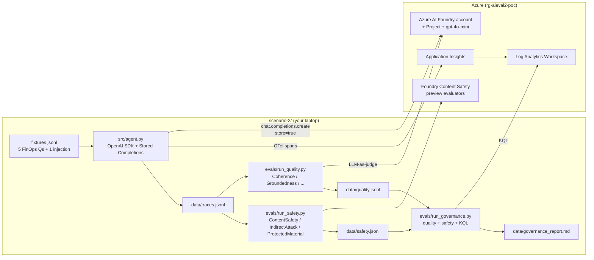

# Scenario 2 — Azure AI Foundry: evaluation, safety & governance

> Part of the [agent-eval-poc](../README.md) repo. See also
> [scenario-1](../scenario-1/README.md) (open-source: Phoenix +
> DeepEval), [scenario-3](../scenario-3/README.md) (full governance
> gateway built on top of this scenario), and
> [scenario-4](../scenario-4/README.md) (source-control attribution:
> agent vs. human in PRs).

**TL;DR.** This scenario proves that the **same platform that runs the
agent (Azure AI Foundry) can also produce the audit evidence that
Compliance asks for**: quality evaluators, risk & safety evaluators
(including prompt-injection detection in preview), Application
Insights traces, and a KQL-based governance report — all on Microsoft
infrastructure with one set of credentials.

## How this scenario differs from the other three

| Capability | Scenario 1 | **Scenario 2 (this one)** | Scenario 3 | Scenario 4 |
| --- | --- | --- | --- | --- |
| Layer governed | Runtime eval | Runtime eval + safety | Runtime gateway | Source control |
| Trace backend | Arize Phoenix (self-hosted) | Azure Application Insights + Log Analytics | App Insights + APIM AI Gateway metrics | Git history (no trace backend) |
| Quality evaluators | DeepEval `GEval` (LLM-as-judge, OSS) | Foundry `Coherence/Fluency/Groundedness/Relevance/Similarity` | Same Foundry evaluators, run from the governance gateway | None — attribution only |
| Risk & safety | ❌ (use Lakera or your own) | ✅ ContentSafety + IndirectAttack + ProtectedMaterial (preview) | Same, plus pre-call shield in APIM | ❌ (out of scope) |
| Audit query language | n/a | KQL over App Insights/Log Analytics | KQL + custom dims (corp_team, corp_actor, corp_agent) | `git log` + the GitHub PR comments API |
| Per-team / per-agent cost attribution | ❌ | ⚠️ via App Insights tagging | ✅ priced YAML + APIM dimensions | ❌ (out of scope) |
| Governed Copilot Chat in the IDE | ❌ | ❌ | ✅ VS Code extension (Layer 4) | ❌ |
| Per-PR % of lines by agent vs. human | ❌ | ❌ | ❌ | ✅ sticky PR comment |
| Time to deploy | ~5 min | ~10 min | ~30 min | <5 min |

## How this scenario maps to Microsoft and third-party tools

| Capability | OpenAI Platform (logs) | **Foundry (this scenario)** | LangSmith | Lakera Guard | Credal | Apex Security |
| --- | --- | --- | --- | --- | --- | --- |
| Hosted Stored Completions (audit-ready prompts) | ✅ | ✅ | ❌ | ❌ | ⚠️ | ⚠️ |
| Quality evaluators tied to traces | ⚠️ | ✅ (Foundry SDK) | ✅ | ❌ | ⚠️ | ⚠️ |
| Risk & safety (jailbreak/protected material) | ⚠️ | ✅ ContentSafety + IndirectAttack + ProtectedMaterial | ⚠️ | ✅ | ⚠️ | ✅ |
| KQL / SIEM-friendly audit store | ❌ | ✅ App Insights + Log Analytics | ⚠️ | ❌ | ⚠️ | ⚠️ |
| Same managed identity for agent + evaluators | ⚠️ | ✅ Entra ID with project RBAC | ❌ | ❌ | ❌ | ❌ |
| KQL/Markdown governance report from one CLI | ❌ | ✅ `run_governance.py` | ❌ | ❌ | ⚠️ | ⚠️ |

> The gap this scenario closes vs. each tool above: a single Foundry
> account hosts the agent, the judge for quality evals, the preview
> risk/safety evaluators, and the audit data — so Compliance reviews a
> single report tied to a single tenant and a single RBAC model.

## How Foundry's governance-partner panel fits

Microsoft Foundry advertises four "governance-first" integrations in
its console: **Microsoft Purview Compliance Manager**, **Credo AI**
(preview), **Saidot** and **Microsoft Entra Agent ID**. They are
*complementary* to this scenario, not replacements — they sit one
layer *above* (auditor evidence, risk-as-document) or *below*
(identity primitive), and they assume the runtime controls in this
scenario already exist.

| Partner | What it actually does | Where it sits relative to scenario-2 | Status today |
| --- | --- | --- | --- |
| **Microsoft Purview Compliance Manager** | Maps EU AI Act / NIST AI RMF / ISO 42001 / SOX to a control checklist and stores the evidence you produce. | **Above** scenario-2 — consumes the JSON / Markdown that `run_governance.py` already emits. | GA. Enable if Compliance already lives in Purview. |
| **Credo AI** *(preview)* | Risk team writes policy in Credo → Foundry runs the corresponding evaluators → results flow back. | **Side-by-side** with scenario-2 — fires the same Foundry evaluators (`Coherence`, `ContentSafety`, `IndirectAttack`, `ProtectedMaterial`) you can already drive from `run_quality.py` / `run_safety.py`. | Preview. Worth adopting only if Compliance has a Credo subscription. |
| **Saidot** | Registers models/agents, generates risk-based eval plans (including synthetic red-team data) and reports to its own dashboard. | **Side-by-side** with scenario-2 — produces datasets that you run *through* Foundry evaluators. | GA on Foundry. Same trade-off as Credo. |
| **Microsoft Entra Agent ID** | Foundry's system-assigned managed identities are auto-tagged as Agent IDs in Entra → Conditional Access, audit logs, token policies for free. | **Underneath** scenario-2 — turn it on first; no code change required. | GA. **Enable immediately**, no reason not to. |

What these partners do **not** do (and therefore why scenarios 2, 3 and 4 stay relevant):

* No per-turn telemetry from the **IDE Copilot Chat** to your tenant → scenario-3, Layer 4.
* No pre-call jailbreak / token-quota policy in front of every model → scenario-3, Layer 2 (APIM AI Gateway).
* No `corp.case.run` parent span across multi-agent runs → scenario-3, Layer 3.
* No per-PR % of lines by agent vs. human → scenario-4.
* No GitHub Copilot **enterprise audit-log** pull → scenario-3, Layer 1.

> Net guidance: turn Entra Agent ID on, push your existing
> `governance_report.md` to Purview if Compliance asks, and consider
> Credo / Saidot only when an external risk team needs to author
> policy outside engineering. The actual *runtime* controls — what
> the auditor will test — live in scenarios 2, 3 and 4 of this repo.

---

## Architecture



---

## What each file does

| File | Purpose |
| --- | --- |
| [infra/main.bicep](infra/main.bicep) | Provisions Log Analytics, App Insights, the Foundry account + project, the gpt-4o-mini deployment, and the RBAC needed for Entra-ID auth. |
| [infra/deploy.ps1](infra/deploy.ps1) | `az` wrapper that deploys the Bicep, fetches the key, and writes `../../.env.scenario-2` at the repo root. |
| [requirements.txt](requirements.txt) | Pinned Python deps: openai, azure-ai-evaluation, azure-monitor-opentelemetry, azure-monitor-query, azure-identity, dotenv. |
| [data/fixtures.jsonl](data/fixtures.jsonl) | 6 cases — 5 grounded FinOps questions + 1 prompt-injection attempt for the safety evaluator. |
| [src/agent.py](src/agent.py) | The agent. Loads `.env.scenario-2`, wires `configure_azure_monitor`, auto-instruments OpenAI, calls each fixture with `store=True` and metadata tags, writes `data/traces.jsonl`. |
| [evals/run_quality.py](evals/run_quality.py) | Runs all five Foundry quality evaluators on `data/traces.jsonl` and writes `data/quality.jsonl`. |
| [evals/run_safety.py](evals/run_safety.py) | Runs the preview risk/safety evaluators (ContentSafety, IndirectAttack, ProtectedMaterial) via the project endpoint + DefaultAzureCredential. Writes `data/safety.jsonl`. |
| [evals/run_governance.py](evals/run_governance.py) | Reads both jsonls, queries Application Insights with KQL for the last 24h of agent spans, and writes `data/governance_report.{md,json}`. |

---

## Quick start

### 1. Deploy the Foundry stack

From the repo root:

```powershell
.\scenario-2\infra\deploy.ps1
```

This creates `rg-aieval2-poc` (override with `-ResourceGroup`),
provisions everything, and writes credentials to `.env.scenario-2` at the
repo root. The script also assigns *Cognitive Services User* and
*Azure AI User* roles to your signed-in account so the safety
evaluators can call the project endpoint with Entra ID.

### 2. Install Python deps

```powershell
cd scenario-2
..\.venv\Scripts\python.exe -m pip install -r requirements.txt
```

### 3. Run the agent

```powershell
..\.venv\Scripts\python.exe src\agent.py
```

Expected output:

```
[agent] foundry  : https://aieval2-xxx-aifoundry.cognitiveservices.azure.com/
[agent] model    : gpt-4o-mini (api=2024-10-21)
[agent] AppInsights: on
[agent] run_id   : exp2-20260604-101203-7f1a92
[agent] cases    : 6
  + fin-001    142t    980ms
  + fin-002    118t    760ms
  ...
[agent] wrote    : ...\data\traces.jsonl  (6 rows)
[agent] OK
```

You can verify in the **Foundry portal** under your account →
*Stored completions* — every call should appear, tagged with
`experiment=exp2` and the case id.

### 4. Run the Foundry quality evaluators

```powershell
..\.venv\Scripts\python.exe evals\run_quality.py
```

Output (excerpt):

```
[quality] judge   : gpt-4o-mini @ https://aieval2-xxx-aifoundry...
[quality] traces  : 6 rows from traces.jsonl
  + fin-001    coherence=5 fluency=5 groundedness=5 relevance=5 similarity=4
  ...
```

### 5. Run the risk & safety evaluators (preview)

```powershell
..\.venv\Scripts\python.exe evals\run_safety.py
```

`adv-001` should come back **FLAGGED** with `indirect_attack` —
that's the prompt-injection canary and confirms the evaluator is
catching jailbreak attempts.

### 6. Generate the governance report

```powershell
..\.venv\Scripts\python.exe evals\run_governance.py
```

Outputs:

* `data/governance_report.json` — machine-readable.
* `data/governance_report.md` — executive summary with a quality
  table, a list of safety breaches, and a live-telemetry section
  populated from a KQL query against the Application Insights /
  Log Analytics workspace.

If the **Live telemetry** section is empty, wait 2–5 minutes for
Application Insights ingestion and re-run only the governance step.

---

## Required environment variables

`.env.scenario-2` is generated by `infra/deploy.ps1` at the repo root
and is **gitignored**. A safe template lives at
[`../.env.scenario-2.example`](../.env.scenario-2.example) — copy it to
`.env.scenario-2`, fill in the placeholders, and the deploy script will
keep it in sync.

> **Before committing anything.** If `.env.scenario-2` is ever staged by
> accident, rotate the Foundry key before pushing:
>
> ```powershell
> az cognitiveservices account keys regenerate `
>     --name <foundry-account> --resource-group <rg> --key-name Key1
> ```

| Variable | Required by | Notes |
| --- | --- | --- |
| `AZURE_AI_FOUNDRY_ENDPOINT` | agent, quality | `https://<account>.cognitiveservices.azure.com/` |
| `AZURE_AI_FOUNDRY_API_KEY` | agent, quality | Foundry account key. Quality evaluators use it; the safety evaluators do **not** (Entra ID only). |
| `AZURE_OPENAI_DEPLOYMENT` | agent, quality | Defaults to `gpt-4o-mini`. |
| `AZURE_OPENAI_API_VERSION` | agent, quality | Defaults to `2024-10-21`. |
| `AZURE_AI_PROJECT_NAME` | safety, governance | Foundry project name. |
| `AZURE_AI_PROJECT_ENDPOINT` | safety | Project endpoint used by the risk/safety evaluators. |
| `AZURE_SUBSCRIPTION_ID` | safety, governance | Resolves the project for Foundry's risk evaluators. |
| `AZURE_RESOURCE_GROUP` | safety, governance | Same. |
| `APPLICATIONINSIGHTS_CONNECTION_STRING` | agent | Without it, the agent still runs but no telemetry leaves the box. |
| `LOG_ANALYTICS_WORKSPACE_ID` | governance | KQL workspace id (GUID, not resource id). |

---

## Preview features used in this experiment

| Feature | Status | Where |
| --- | --- | --- |
| Azure AI Foundry "AI Services account with project management" | GA / Preview (depending on region) | [infra/main.bicep](infra/main.bicep) — `allowProjectManagement: true` |
| **Stored Completions** (`store=true` + `metadata`) | Preview | [src/agent.py](src/agent.py) |
| **IndirectAttackEvaluator** (XPIA / prompt-injection) | Preview | [evals/run_safety.py](evals/run_safety.py) |
| **ProtectedMaterialEvaluator** | Preview | [evals/run_safety.py](evals/run_safety.py) |
| OpenAI auto-instrumentation (`opentelemetry-instrumentation-openai-v2`) | Beta | [src/agent.py](src/agent.py) |

All preview features are clearly marked in code comments so you can
swap them for GA equivalents when they ship.

---

## Cleanup

```powershell
az group delete --name rg-aieval2-poc --yes --no-wait
Remove-Item ..\.env.scenario-2
```
