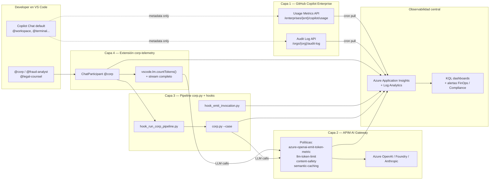

# Governance architecture — quién, qué y cuánto

> Objetivo: control total y auditable de cada interacción con LLMs en la
> organización — **quién** invoca, **qué** agente, **qué** modelo, **cuántos**
> tokens y **cuánto** cuesta — y poder bloquear/explicar cada decisión.

---

## 0. La verdad incómoda primero

Una sola herramienta NO resuelve el problema. La razón es un límite duro de
plataforma:

| Componente | Expone prompt? | Expone respuesta? | Expone modelo? | Expone tokens? |
|---|---|---|---|---|
| GitHub Copilot Chat (IDE, modelo por defecto) | ❌ | ❌ | ❌ por turno | ❌ por turno |
| GitHub Copilot Audit Log API | ❌ | ❌ | ❌ | sólo agregados |
| GitHub Copilot Usage Metrics API | ❌ | ❌ | ❌ | sólo agregados |
| VS Code `vscode.lm` API (extensión propia) | ✅ tu participant | ✅ tu participant | ✅ | ✅ via `countTokens()` |
| Hooks `.agent.md` / `.github/hooks/*.json` | sólo `prompt` | ❌ | ❌ | ❌ |
| APIM AI Gateway (proxy LLM corporativo) | ✅ | ✅ | ✅ | ✅ exacto del proveedor |
| `corp.py` (orquestador propio sobre Azure OpenAI) | ✅ | ✅ | ✅ | ✅ exacto |

→ Conclusión: **arquitectura en 4 capas** que combinadas cubren el 100 %.

---

## 1. Vista general



---

## 2. Capa 1 — GitHub Copilot Enterprise audit & usage

### Qué cubre

- **Quién** usa Copilot (por usuario, por equipo, por repo)
- **Cuándo** y **cuántos** turnos de chat / sugerencias acepta
- **Qué** features (Chat, completions, PR summaries…)
- Eventos de **policy violations** y **content filtering**

### Qué NO cubre

- Contenido del prompt o de la respuesta
- Modelo concreto usado en cada turno (Copilot lo selecciona)
- Tokens y coste por turno (sólo agregados diarios)

### Implementación

- Script Python `scenario-3/tools/copilot_audit_pull.py`:
  - Lee `GITHUB_TOKEN` con scope `read:audit_log` + `manage_billing:copilot`
  - Llama:
    - `GET /enterprises/{ent}/audit-log?phrase=action:copilot`
    - `GET /enterprises/{ent}/copilot/usage`
    - `GET /enterprises/{ent}/copilot/billing/seats`
  - Pagina, deduplica, emite a App Insights como `customEvents`:
    - `copilot.audit.event` (un span por evento)
    - `copilot.usage.daily` (un span por día/usuario)
- Ejecutar cada hora desde GitHub Actions (cron) o desde Azure Functions Timer.

### Esquema en App Insights

```text
customEvents
| where name == "copilot.audit.event"
| extend
    actor      = tostring(customDimensions["github.actor"]),
    action     = tostring(customDimensions["github.action"]),
    repo       = tostring(customDimensions["github.repo"]),
    feature    = tostring(customDimensions["copilot.feature"]),
    team       = tostring(customDimensions["github.team"])
```

---

## 3. Capa 2 — APIM AI Gateway (la pieza más potente)

### Qué cubre

**Todo el tráfico LLM corporativo que NO sea Copilot Chat IDE**:
- `corp.py` → Azure OpenAI
- Apps internas → Azure OpenAI / Foundry
- Copilot SDK / Copilot Extensions → backend modelos
- Agentes Foundry hosted

→ Para cada llamada: prompt, respuesta, modelo exacto, tokens reales del
proveedor, latencia, coste, usuario (vía JWT/API key), bloqueo de jailbreaks.

### Qué NO cubre

- GitHub Copilot Chat IDE — esa llamada va GitHub → modelos cerrados, no podemos
  meterla por nuestro APIM (limitación de plataforma).

### Diseño

- **Recurso**: `apim-corp-aigateway` (SKU StandardV2 mínimo para policies AI)
- **Backend pool**: Azure OpenAI (modelos prod) + Foundry (modelos staging)
- **Políticas globales** (todas en `policies/global.xml`):

  | Política | Propósito |
  |---|---|
  | `validate-jwt` | Identifica al usuario (Entra ID) |
  | `azure-openai-emit-token-metric` | Métrica oficial de tokens → App Insights |
  | `llm-emit-token-metric` | Misma idea para backends no-OpenAI |
  | `azure-openai-token-limit` | Cuota por usuario/equipo |
  | `llm-content-safety` | Bloqueo de jailbreaks y prompt injection |
  | `azure-openai-semantic-cache-store/lookup` | Ahorro de coste |
  | `set-header X-Corr-Id` | Trazabilidad cross-capa |
  | `log-to-eventhub` | Audit completo (prompt + completion) a Event Hub → ADX |

- **Producto**: `corp-llm` con suscripción por equipo (`finance-forensics`,
  `legal`, `governance`).
- **Diagnostic settings**: → mismo App Insights que Capa 1, 3 y 4.

### Esquema en App Insights

```text
customMetrics
| where name in ("Total Tokens", "Prompt Tokens", "Completion Tokens")
| extend
    user      = tostring(customDimensions["User"]),
    model     = tostring(customDimensions["DeploymentName"]),
    operation = tostring(customDimensions["operation_Name"]),
    api       = tostring(customDimensions["ApiName"])
```

### Implementación

- Bicep: `scenario-3/infra/aigateway.bicep` (módulo APIM + AOAI backend)
- Policies: `scenario-3/infra/policies/*.xml`
- `azd up` desde `scenario-3/azure.yaml`

> Skill aplicable: `azure-aigateway` (cuando entremos a generar el código).

---

## 4. Capa 3 — Pipeline `corp.py` + hooks (ya implementado)

### Qué cubre

- **Cualquier invocación** a `@corp`, `@fraud-analyst`, `@legal-counsel` desde
  el IDE o batch:
  - Hook `UserPromptSubmit` ejecuta `hook_run_corp_pipeline.py` que dispara
    `corp.py --case <id>` sin intervención del LLM.
  - Spans OpenTelemetry: `corp.case.run` (padre) + N × `corp.agent.invocation`
    (hijos) con verdict, tokens, coste, corr_id.
- **Cualquier turno IDE** a esos 3 agentes (vía hook inline + workspace hook):
  - `corp.agent.invocation` con `corp.model_known=false`, `corp.stage=ide-prompt`
  - Marca el turno aunque el modelo subyacente sea opaco.

### Qué NO cubre

- Conversaciones a otros agentes del IDE (Copilot default, agentes de terceros).

### Estado

- ✅ `scenario-3/tools/hook_emit_invocation.py`
- ✅ `scenario-3/tools/hook_run_corp_pipeline.py`
- ✅ `.github/agents/{corp,fraud-analyst,legal-counsel}.agent.md`
- ✅ `.github/hooks/governance.json`
- ✅ `scenario-3/src/{corp.py,telemetry.py,pipeline.py,pricing.yaml}`

---

## 5. Capa 4 — Extensión VS Code `corp-telemetry`

### Qué cubre

- Sustituye al `.agent.md` de `@corp`:
  - Registra un `ChatParticipant` programático.
  - Tiene acceso a `request.model` (modelo real elegido por el usuario en el
    dropdown del chat) → captura `family`, `version`, `id`.
  - Llama `model.countTokens(prompt)` para input tokens **oficiales**.
  - Hace `model.sendRequest()` ella misma, así puede contar el output token
    a token.
  - Calcula coste con `pricing.yaml`, emite span a App Insights, llama por
    debajo a `corp.py` para meter al fraud-analyst y legal-counsel.

### Qué NO cubre

- Otros participants ni chat default — un participant sólo ve sus propios
  turnos (límite VS Code).

### Estructura

```text
vscode-ext/corp-telemetry/
├── package.json              # contributes.chatParticipants[]: @corp
├── tsconfig.json
├── src/
│   ├── extension.ts          # activate(): registerChatParticipant('corp', handler)
│   ├── handler.ts            # captura request.model, tokens, stream
│   ├── telemetry.ts          # ApplicationInsights TelemetryClient
│   └── pricing.ts            # carga pricing.yaml compartido
└── README.md
```

### APIs clave

```ts
const [model] = await vscode.lm.selectChatModels({ family: request.model.family });
const inputTokens = await model.countTokens(prompt);
const response = await model.sendRequest(messages, {}, token);
let outputTokens = 0;
for await (const chunk of response.text) {
    outputTokens += await model.countTokens(chunk);
    stream.markdown(chunk);
}
telemetry.emit('corp.agent.invocation', {
    'gen_ai.request.model':       model.family + ':' + model.version,
    'gen_ai.usage.input_tokens':  inputTokens,
    'gen_ai.usage.output_tokens': outputTokens,
    'corp.actor':                 context.userId,
    'corp.cost_usd':              calcCost(model, inputTokens, outputTokens),
    'corp.corr_id':               corrId,
    'corp.model_known':           true,
});
```

### Política recomendada en Copilot Enterprise

Una vez la extensión esté desplegada en el Marketplace interno:

- **Bloquear** otros chat participants no aprobados (vía `chat.commandCenter.experimental.enabled` + lista blanca de extensiones de la org).
- **Forzar** `@corp` como única vía para análisis governance (vía
  `.github/copilot-instructions.md` + revisión de PR).

---

## 6. Mapping de necesidades → capa

| Necesito saber… | Capa que lo da |
|---|---|
| ¿Cuántos turnos hace Pepe a Copilot Chat al mes? | Capa 1 (usage API) |
| ¿Qué repos usan Copilot? | Capa 1 (audit log) |
| ¿Hay alguien filtrando código sensible por prompt? | Capa 2 (content-safety + log-to-eventhub) |
| Coste total LLM en EUR del mes pasado | Capa 2 (token metric) + Capa 3 (corp.cost_usd) |
| ¿Qué modelo eligió `@corp` en el turno X? | Capa 4 (extension) |
| ¿Pepe invocó `@fraud-analyst` sobre el caso 012? | Capa 3 (corp.agent.invocation) |
| ¿Cuántos jailbreaks bloqueamos esta semana? | Capa 2 (content-safety policy) |
| ¿Qué developer aún no usa Copilot? (waste de licencia) | Capa 1 (seats API) |

---

## 7. Roadmap de implementación

| Sprint | Capa | Entregable | Skill |
|---|---|---|---|
| 1 | **1** | `tools/copilot_audit_pull.py` + GitHub Action cron | — |
| 2 | **2** | `infra/aigateway.bicep` + policies XML + `azd up` en RG governance | `azure-aigateway` |
| 3 | **2** | Migrar `corp.py` para que las llamadas a Azure OpenAI vayan por APIM | `azure-aigateway` |
| 4 | **4** | Scaffold extensión + ChatParticipant + telemetría | `agent-customization` |
| 5 | **4** | Pack & publish en Marketplace privado de la org | — |
| 6 | todos | Dashboard KQL único en App Insights con las 4 capas correlacionadas por `corr_id` | `azure-kusto` |

---

## 8. KQL maestro (cuando esté todo en App Insights)

```kusto
// Vista 360: qué pasó con un usuario en las últimas 24h
let actor = "jose.flores@example.com";
union
    (customEvents | where name startswith "copilot."),
    (dependencies | where name startswith "corp."),
    (customMetrics | where name has "Tokens")
| where timestamp > ago(24h)
| where tostring(customDimensions["github.actor"]) == actor
     or tostring(customDimensions["corp.actor"])   == actor
     or tostring(customDimensions["User"])         == actor
| project
    timestamp,
    layer = case(
        name startswith "copilot.",       "L1 GitHub",
        name has "Tokens",                "L2 APIM",
        name startswith "corp.agent.",    "L3 corp.py / hook",
        name startswith "corp.ext.",      "L4 extension",
        "?"),
    name,
    model = coalesce(
        tostring(customDimensions["gen_ai.request.model"]),
        tostring(customDimensions["DeploymentName"])),
    tokens_in  = toint(customDimensions["gen_ai.usage.input_tokens"]),
    tokens_out = toint(customDimensions["gen_ai.usage.output_tokens"]),
    cost_usd   = todouble(customDimensions["corp.cost_usd"]),
    corr_id    = tostring(customDimensions["corp.corr_id"])
| order by timestamp desc
```

---

## 9. Lo que NUNCA tendremos (y cómo mitigarlo)

| Limitación | Mitigación |
|---|---|
| Contenido de prompts a Copilot Chat default | Política org: prohibir secretos en prompts + DLP en endpoints |
| Modelo real de Copilot Chat default | Asumir worst-case en pricing; usar dashboard de billing de GitHub |
| Tokens reales por turno de Copilot Chat default | Estimación con tiktoken sobre prompt visible al hook (sólo input) |
| Conversaciones a chat participants de terceros | Lista blanca de extensiones + revisión de PRs |

---

*Documento vivo. Actualizar al cerrar cada sprint del roadmap.*
