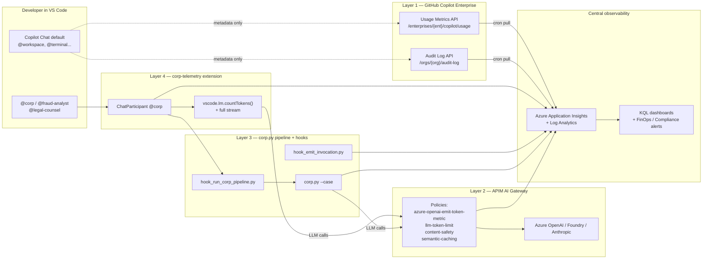

# Governance architecture — who, what and how much

> Goal: full, auditable control of every LLM interaction in the organization —
> **who** invokes it, **which** agent, **which** model, **how many** tokens and
> **how much** it costs — with the ability to block and explain every decision.

---

## 0. The uncomfortable truth first

A single tool will NOT solve this problem. The reason is a hard platform
limitation:

| Component | Exposes prompt? | Exposes response? | Exposes model? | Exposes tokens? |
|---|---|---|---|---|
| GitHub Copilot Chat (IDE, default model) | ❌ | ❌ | ❌ per turn | ❌ per turn |
| GitHub Copilot Audit Log API | ❌ | ❌ | ❌ | aggregates only |
| GitHub Copilot Usage Metrics API | ❌ | ❌ | ❌ | aggregates only |
| VS Code `vscode.lm` API (your own extension) | ✅ your participant | ✅ your participant | ✅ | ✅ via `countTokens()` |
| Hooks `.agent.md` / `.github/hooks/*.json` | `prompt` only | ❌ | ❌ | ❌ |
| APIM AI Gateway (corporate LLM proxy) | ✅ | ✅ | ✅ | ✅ exact, from the provider |
| `corp.py` (in-house orchestrator on top of Azure OpenAI) | ✅ | ✅ | ✅ | ✅ exact |

→ Conclusion: **a 4-layer architecture** that, combined, covers 100%.

---

## 1. Overview



---

## 2. Layer 1 — GitHub Copilot Enterprise audit & usage

### What it covers

- **Who** uses Copilot (per user, per team, per repo)
- **When** and **how many** chat turns / suggestions they accept
- **Which** features (Chat, completions, PR summaries…)
- **Policy violation** and **content filtering** events

### What it does NOT cover

- Prompt or response content
- The specific model used on each turn (Copilot picks it)
- Tokens and cost per turn (daily aggregates only)

### Implementation

- Python script `scenario-3/tools/copilot_audit_pull.py`:
  - Reads `GITHUB_TOKEN` with scope `read:audit_log` + `manage_billing:copilot`
  - Calls:
    - `GET /enterprises/{ent}/audit-log?phrase=action:copilot`
    - `GET /enterprises/{ent}/copilot/usage`
    - `GET /enterprises/{ent}/copilot/billing/seats`
  - Paginates, deduplicates, emits to App Insights as `customEvents`:
    - `copilot.audit.event` (one span per event)
    - `copilot.usage.daily` (one span per day/user)
- Run hourly from GitHub Actions (cron) or from an Azure Functions Timer.

### App Insights schema

```text
customEvents
| where name == "copilot.audit.event"
| extend
    actor      = tostring(customDimensions["github.actor"]),
    action     = tostring(customDimensions["github.action"]),
    repo       = tostring(customDimensions["github.repo"]),
    feature    = tostring(customDimensions["copilot.feature"]),
    team       = tostring(customDimensions["github.team"])
```

---

## 3. Layer 2 — APIM AI Gateway (the most powerful piece)

### What it covers

**All corporate LLM traffic that is NOT Copilot Chat IDE**:
- `corp.py` → Azure OpenAI
- Internal apps → Azure OpenAI / Foundry
- Copilot SDK / Copilot Extensions → backend models
- Hosted Foundry agents

→ For every call: prompt, response, exact model, real provider tokens,
latency, cost, user (via JWT/API key), jailbreak blocking.

### What it does NOT cover

- GitHub Copilot Chat IDE — that call goes GitHub → closed models, we cannot
  route it through our APIM (platform limitation).
- **Any agent or app holding raw model keys/endpoints** — if it knows the
  AOAI/Foundry API key it calls the model directly and bypasses the entire
  gateway. The gateway is NOT a control unless it is the *only* path to the
  model.

### Integrity precondition (read before "this covers 100%")

Layers 2–4 only truly govern if TWO conditions hold — this POC assumes them
but **does not enforce** them:

1. **Egress is blocked**: the model is reachable *exclusively* through the
   gateway (private endpoint + NSG/firewall; no direct egress to
   `*.openai.azure.com`).
2. **Zero raw keys in circulation**: `disableLocalAuth=true` on the
   AOAI/Foundry account and authentication only via Entra ID / managed
   identity. As long as an API key sits in a `.env`, the control is
   optional.

Without both, RULE 0 ("everything goes through @corp") is a convention
enforced by an after-the-fact evaluator (a **detective** control), not a
**preventive** one.

### Design

- **Resource**: `apim-corp-aigateway` (StandardV2 SKU minimum for AI policies)
- **Backend pool**: Azure OpenAI (prod models) + Foundry (staging models)
- **Global policies** (all in `policies/global.xml`):

  | Policy | Purpose |
  |---|---|
  | `validate-jwt` | Identifies the user (Entra ID) |
  | `azure-openai-emit-token-metric` | Official token metric → App Insights |
  | `llm-emit-token-metric` | Same idea for non-OpenAI backends |
  | `azure-openai-token-limit` | Quota per user/team |
  | `llm-content-safety` | Blocks jailbreaks and prompt injection |
  | `azure-openai-semantic-cache-store/lookup` | Cost savings |
  | `set-header X-Corr-Id` | Cross-layer traceability |
  | `log-to-eventhub` | Full audit (prompt + completion) to Event Hub → ADX |

- **Product**: `corp-llm` with subscription per team (`finance-forensics`,
  `legal`, `governance`).
- **Diagnostic settings**: → same App Insights as layers 1, 3 and 4.

### App Insights schema

```text
customMetrics
| where name in ("Total Tokens", "Prompt Tokens", "Completion Tokens")
| extend
    user      = tostring(customDimensions["User"]),
    model     = tostring(customDimensions["DeploymentName"]),
    operation = tostring(customDimensions["operation_Name"]),
    api       = tostring(customDimensions["ApiName"])
```

### Implementation

- Bicep: `scenario-3/infra/aigateway.bicep` (APIM module + AOAI backend)
- Policies: `scenario-3/infra/policies/*.xml`
- `azd up` from `scenario-3/azure.yaml`

> Applicable skill: `azure-aigateway` (when we get to code generation).

---

## 4. Layer 3 — `corp.py` pipeline + hooks (already implemented)

### What it covers

- **Every invocation** of `@corp`, `@fraud-analyst`, `@legal-counsel` from
  the IDE or in batch:
  - The `UserPromptSubmit` hook runs `hook_run_corp_pipeline.py`, which fires
    `corp.py --case <id>` without LLM involvement.
  - OpenTelemetry spans: `corp.case.run` (parent) + N × `corp.agent.invocation`
    (children) with verdict, tokens, cost, corr_id.
- **Every IDE turn** to those 3 agents (via inline hook + workspace hook):
  - `corp.agent.invocation` with `corp.model_known=false`, `corp.stage=ide-prompt`
  - Marks the turn even when the underlying model is opaque.

### What it does NOT cover

- Conversations with other IDE agents (default Copilot, third-party agents).

### Status

- ✅ `scenario-3/tools/hook_emit_invocation.py`
- ✅ `scenario-3/tools/hook_run_corp_pipeline.py`
- ✅ `.github/agents/{corp,fraud-analyst,legal-counsel}.agent.md`
- ✅ `.github/hooks/governance.json`
- ✅ `scenario-3/src/{corp.py,telemetry.py,pipeline.py,pricing.yaml}`

---

## 5. Layer 4 — VS Code extension `corp-telemetry`

### What it covers

- Replaces the `.agent.md` for `@corp`:
  - Registers a programmatic `ChatParticipant`.
  - Has access to `request.model` (the real model the user picked in the chat
    dropdown) → captures `family`, `version`, `id`.
  - Calls `model.countTokens(prompt)` for **official** input tokens.
  - Calls `model.sendRequest()` itself, so it can count output tokens
    chunk by chunk.
  - Calculates cost with `pricing.yaml`, emits a span to App Insights, and
    underneath calls `corp.py` to invoke fraud-analyst and legal-counsel.

### What it does NOT cover

- Other participants or default chat — a participant only sees its own turns
  (VS Code limitation).

### Structure

```text
vscode-ext/corp-telemetry/
├── package.json              # contributes.chatParticipants[]: @corp
├── tsconfig.json
├── src/
│   ├── extension.ts          # activate(): registerChatParticipant('corp', handler)
│   ├── handler.ts            # captures request.model, tokens, stream
│   ├── telemetry.ts          # ApplicationInsights TelemetryClient
│   └── pricing.ts            # loads shared pricing.yaml
└── README.md
```

### Key APIs

```ts
const [model] = await vscode.lm.selectChatModels({ family: request.model.family });
const inputTokens = await model.countTokens(prompt);
const response = await model.sendRequest(messages, {}, token);
let outputTokens = 0;
for await (const chunk of response.text) {
    outputTokens += await model.countTokens(chunk);
    stream.markdown(chunk);
}
telemetry.emit('corp.agent.invocation', {
    'gen_ai.request.model':       model.family + ':' + model.version,
    'gen_ai.usage.input_tokens':  inputTokens,
    'gen_ai.usage.output_tokens': outputTokens,
    'corp.actor':                 context.userId,
    'corp.cost_usd':              calcCost(model, inputTokens, outputTokens),
    'corp.corr_id':               corrId,
    'corp.model_known':           true,
});
```

### Recommended Copilot Enterprise policy

Once the extension is deployed to the internal Marketplace:

- **Block** other non-approved chat participants (via
  `chat.commandCenter.experimental.enabled` + an org allow-list of extensions).
- **Force** `@corp` as the only path for governance analysis (via
  `.github/copilot-instructions.md` + PR review).

---

## 6. Needs → layer mapping

| I need to know… | Layer that provides it |
|---|---|
| How many turns does Pepe send to Copilot Chat per month? | Layer 1 (usage API) |
| Which repos use Copilot? | Layer 1 (audit log) |
| Is anyone leaking sensitive code via prompts? | Layer 2 (content-safety + log-to-eventhub) |
| Total LLM cost in EUR last month | Layer 2 (token metric) + Layer 3 (corp.cost_usd) |
| Which model did `@corp` pick on turn X? | Layer 4 (extension) |
| Did Pepe invoke `@fraud-analyst` for case 012? | Layer 3 (corp.agent.invocation) |
| How many jailbreaks did we block this week? | Layer 2 (content-safety policy) |
| Which devs are still not using Copilot? (license waste) | Layer 1 (seats API) |

---

## 7. Implementation roadmap

| Sprint | Layer | Deliverable | Skill |
|---|---|---|---|
| 1 | **1** | `tools/copilot_audit_pull.py` + GitHub Action cron | — |
| 2 | **2** | `infra/aigateway.bicep` + policies XML + `azd up` in governance RG | `azure-aigateway` |
| 3 | **2** | Migrate `corp.py` so Azure OpenAI calls go through APIM | `azure-aigateway` |
| 4 | **4** | Scaffold the extension + ChatParticipant + telemetry | `agent-customization` |
| 5 | **4** | Pack & publish in the org's private Marketplace | — |
| 6 | all | Single KQL dashboard in App Insights with the 4 layers correlated by `corr_id` | `azure-kusto` |

---

## 8. Master KQL (once everything is in App Insights)

```kusto
// 360 view: what happened with a user in the last 24h
let actor = "someone@example.com";
union
    (customEvents | where name startswith "copilot."),
    (dependencies | where name startswith "corp."),
    (customMetrics | where name has "Tokens")
| where timestamp > ago(24h)
| where tostring(customDimensions["github.actor"]) == actor
     or tostring(customDimensions["corp.actor"])   == actor
     or tostring(customDimensions["User"])         == actor
| project
    timestamp,
    layer = case(
        name startswith "copilot.",       "L1 GitHub",
        name has "Tokens",                "L2 APIM",
        name startswith "corp.agent.",    "L3 corp.py / hook",
        name startswith "corp.ext.",      "L4 extension",
        "?"),
    name,
    model = coalesce(
        tostring(customDimensions["gen_ai.request.model"]),
        tostring(customDimensions["DeploymentName"])),
    tokens_in  = toint(customDimensions["gen_ai.usage.input_tokens"]),
    tokens_out = toint(customDimensions["gen_ai.usage.output_tokens"]),
    cost_usd   = todouble(customDimensions["corp.cost_usd"]),
    corr_id    = tostring(customDimensions["corp.corr_id"])
| order by timestamp desc
```

---

## 9. What we will NEVER have (and how to mitigate it)

| Limitation | Mitigation |
|---|---|
| Prompt content for default Copilot Chat | Org policy: ban secrets in prompts + DLP on endpoints |
| Real model for default Copilot Chat | Assume worst-case pricing; use GitHub's billing dashboard |
| Real tokens per turn for default Copilot Chat | Estimate with tiktoken on the prompt visible to the hook (input only) |
| Conversations with third-party chat participants | Extension allow-list + PR review |

---

*Living document. Update at the end of each roadmap sprint.*
